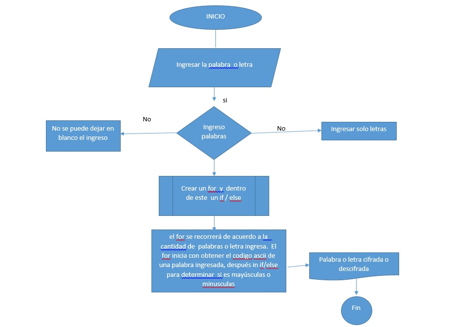

ALGORITMO DE CIFRADO DE CESAR
 
 Este programa permite:

      -Cifrar una letra o palabra
      -Descifrar una letra o palabra

La palabra ingresada debe cumplir :

  -No puede dejar de llenarse el cuadro de texto
  
  -No debe contener ningun numero
  
Al final entrega la palabra  o letra cifrada o palabra o letra decifrada

